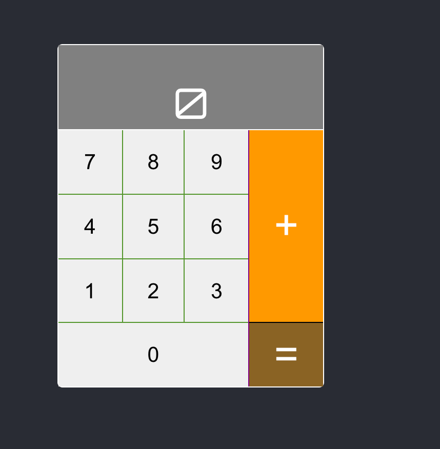

# Dreamed DMS calculator demo application



This is my dummy application for showing various ways to test web apps.

## Set up

### Front 🍕

```bash
cd front
npm i
npm start &
```

### Backend 🍣

**Don't forget to create a virtual environment 👩🏼‍🏫.. or not what ever... 🤷‍♂️**
```bash
pip install -r requirements.txt
pythoh manager.py runserver
```

### Docker - TBD 🐳
For now, there's an issue with connecting the front to the backend via docker. Not sure why.
```bash
docker-compose up -d 
```

